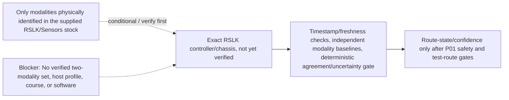

# RSLK Sensor Fusion and Autonomous Perception — System Block Diagram

```mermaid
flowchart LR
    S["Only modalities physically identified in the supplied RSLK/Sensors stock"] -. conditional / verify first .-> H["Exact RSLK controller/chassis, not yet verified"]
    H --> Q["Timestamp/freshness checks, independent modality baselines, deterministic agreement/uncertainty gate"]
    Q --> O["Route-state/confidence only after P01 safety and test-route gates"]
    B["Blocker: No verified two-modality set, host profile, course, or software"] -.-> H
```

Research architecture only. No physical path has been tested.
