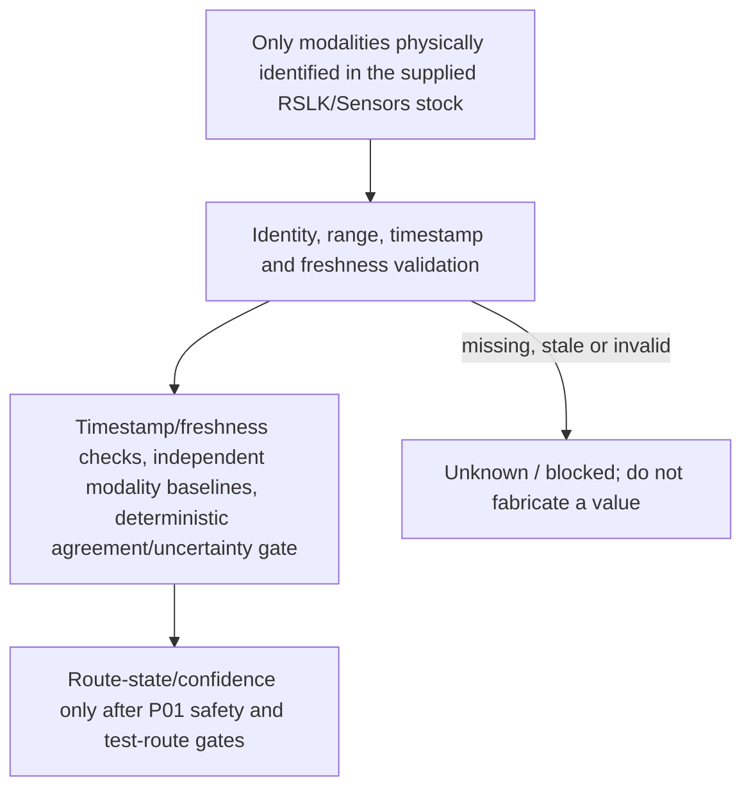

# RSLK Sensor Fusion and Autonomous Perception — Data Flow

```mermaid
flowchart TD
    A["Only modalities physically identified in the supplied RSLK/Sensors stock"] --> V["Identity, range, timestamp and freshness validation"]
    V --> P["Timestamp/freshness checks, independent modality baselines, deterministic agreement/uncertainty gate"]
    P --> O["Route-state/confidence only after P01 safety and test-route gates"]
    V -->|missing, stale or invalid| U["Unknown / blocked; do not fabricate a value"]
```

No sample schema or measurements are available yet.
