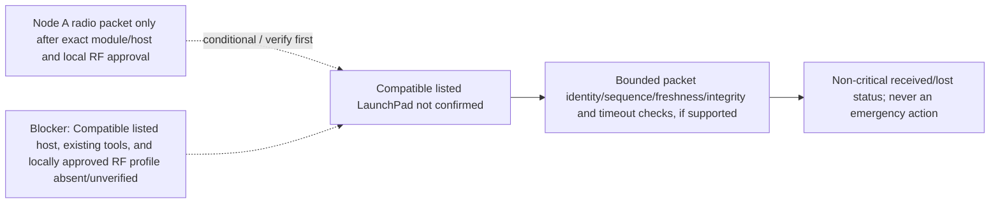

# Long-Range Industrial Emergency Wireless Network — System Block Diagram

```mermaid
flowchart LR
    S["Node A radio packet only after exact module/host and local RF approval"] -. conditional / verify first .-> H["Compatible listed LaunchPad not confirmed"]
    H --> Q["Bounded packet identity/sequence/freshness/integrity and timeout checks, if supported"]
    Q --> O["Non-critical received/lost status; never an emergency action"]
    B["Blocker: Compatible listed host, existing tools, and locally approved RF profile absent/unverified"] -.-> H
```

Research architecture only. No physical path has been tested.
