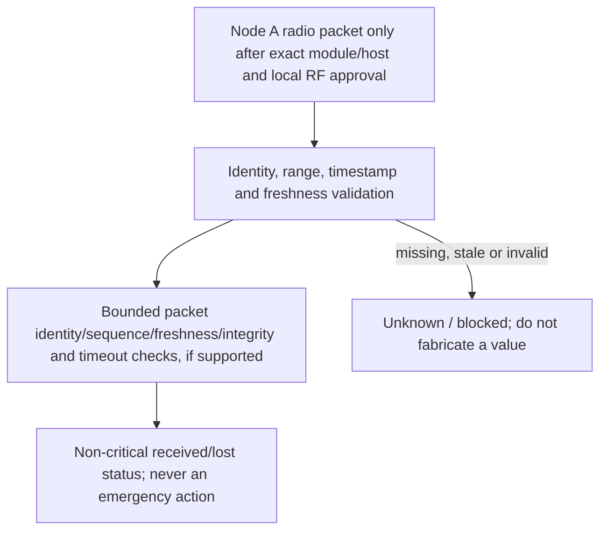

# Long-Range Industrial Emergency Wireless Network — Data Flow

```mermaid
flowchart TD
    A["Node A radio packet only after exact module/host and local RF approval"] --> V["Identity, range, timestamp and freshness validation"]
    V --> P["Bounded packet identity/sequence/freshness/integrity and timeout checks, if supported"]
    P --> O["Non-critical received/lost status; never an emergency action"]
    V -->|missing, stale or invalid| U["Unknown / blocked; do not fabricate a value"]
```

No sample schema or measurements are available yet.
