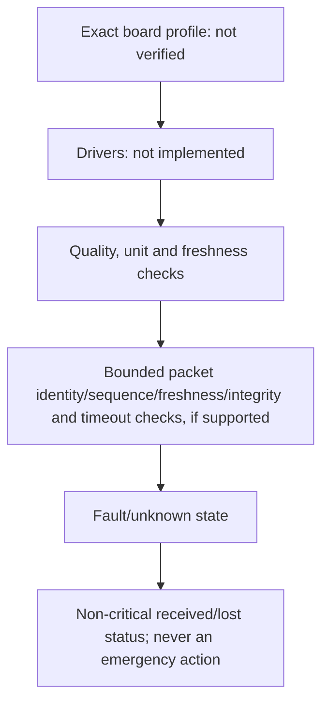

# Long-Range Industrial Emergency Wireless Network — Software Architecture

```mermaid
flowchart TB
    C["Exact board profile: not verified"] --> D["Drivers: not implemented"]
    D --> Q["Quality, unit and freshness checks"]
    Q --> A["Bounded packet identity/sequence/freshness/integrity and timeout checks, if supported"]
    A --> F["Fault/unknown state"]
    F --> O["Non-critical received/lost status; never an emergency action"]
```

Software design only. Toolchain and code are not confirmed or implemented.
