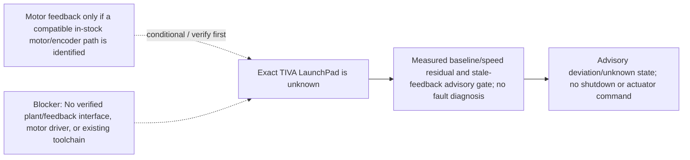

# Real-Time Industrial Motor Condition Monitoring — System Block Diagram

```mermaid
flowchart LR
    S["Motor feedback only if a compatible in-stock motor/encoder path is identified"] -. conditional / verify first .-> H["Exact TIVA LaunchPad is unknown"]
    H --> Q["Measured baseline/speed residual and stale-feedback advisory gate; no fault diagnosis"]
    Q --> O["Advisory deviation/unknown state; no shutdown or actuator command"]
    B["Blocker: No verified plant/feedback interface, motor driver, or existing toolchain"] -.-> H
```

Research architecture only. No physical path has been tested.
