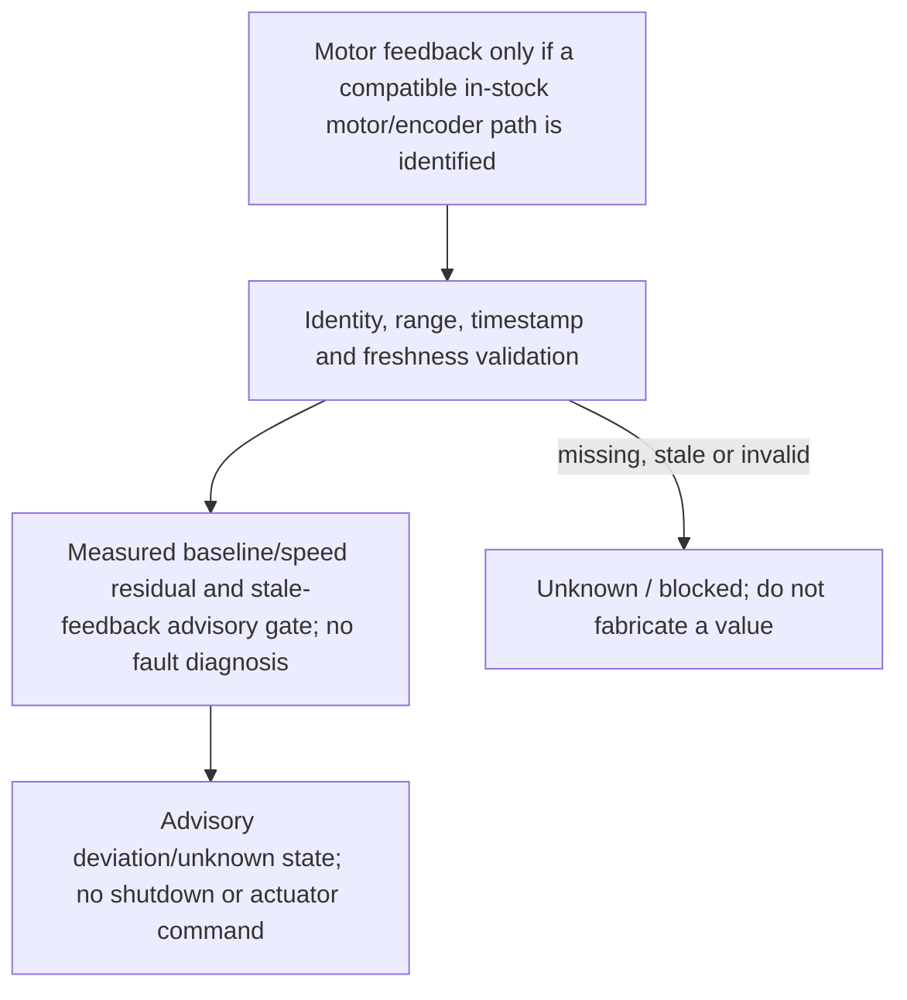

# Real-Time Industrial Motor Condition Monitoring — Data Flow

```mermaid
flowchart TD
    A["Motor feedback only if a compatible in-stock motor/encoder path is identified"] --> V["Identity, range, timestamp and freshness validation"]
    V --> P["Measured baseline/speed residual and stale-feedback advisory gate; no fault diagnosis"]
    P --> O["Advisory deviation/unknown state; no shutdown or actuator command"]
    V -->|missing, stale or invalid| U["Unknown / blocked; do not fabricate a value"]
```

No sample schema or measurements are available yet.
