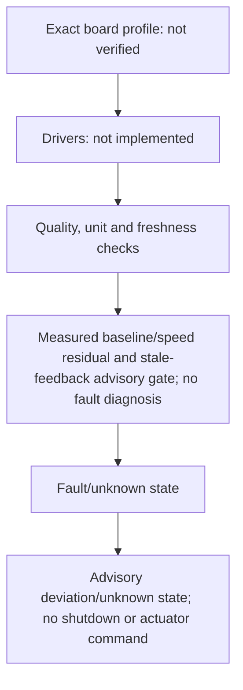

# Real-Time Industrial Motor Condition Monitoring — Software Architecture

```mermaid
flowchart TB
    C["Exact board profile: not verified"] --> D["Drivers: not implemented"]
    D --> Q["Quality, unit and freshness checks"]
    Q --> A["Measured baseline/speed residual and stale-feedback advisory gate; no fault diagnosis"]
    A --> F["Fault/unknown state"]
    F --> O["Advisory deviation/unknown state; no shutdown or actuator command"]
```

Software design only. Toolchain and code are not confirmed or implemented.
