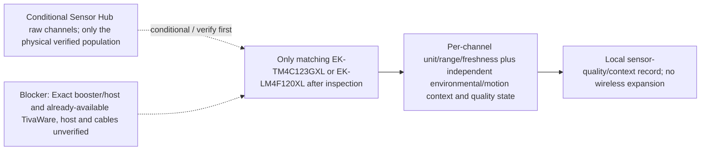

# Distributed Sensor Fusion using SenseHUB — System Block Diagram

```mermaid
flowchart LR
    S["Conditional Sensor Hub raw channels; only the physical verified population"] -. conditional / verify first .-> H["Only matching EK-TM4C123GXL or EK-LM4F120XL after inspection"]
    H --> Q["Per-channel unit/range/freshness plus independent environmental/motion context and quality state"]
    Q --> O["Local sensor-quality/context record; no wireless expansion"]
    B["Blocker: Exact booster/host and already-available TivaWare, host and cables unverified"] -.-> H
```

Research architecture only. No physical path has been tested.
