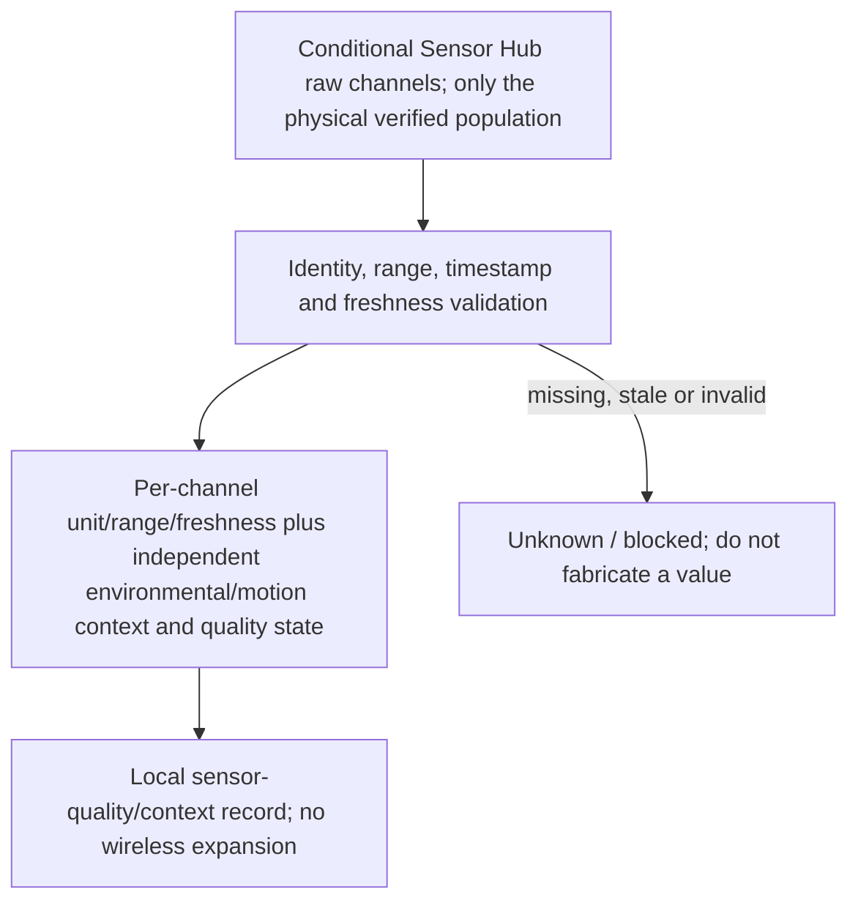

# Distributed Sensor Fusion using SenseHUB — Data Flow

```mermaid
flowchart TD
    A["Conditional Sensor Hub raw channels; only the physical verified population"] --> V["Identity, range, timestamp and freshness validation"]
    V --> P["Per-channel unit/range/freshness plus independent environmental/motion context and quality state"]
    P --> O["Local sensor-quality/context record; no wireless expansion"]
    V -->|missing, stale or invalid| U["Unknown / blocked; do not fabricate a value"]
```

No sample schema or measurements are available yet.
