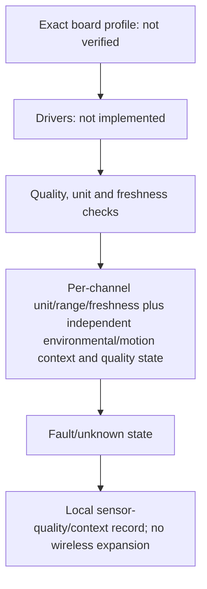

# Distributed Sensor Fusion using SenseHUB — Software Architecture

```mermaid
flowchart TB
    C["Exact board profile: not verified"] --> D["Drivers: not implemented"]
    D --> Q["Quality, unit and freshness checks"]
    Q --> A["Per-channel unit/range/freshness plus independent environmental/motion context and quality state"]
    A --> F["Fault/unknown state"]
    F --> O["Local sensor-quality/context record; no wireless expansion"]
```

Software design only. Toolchain and code are not confirmed or implemented.
