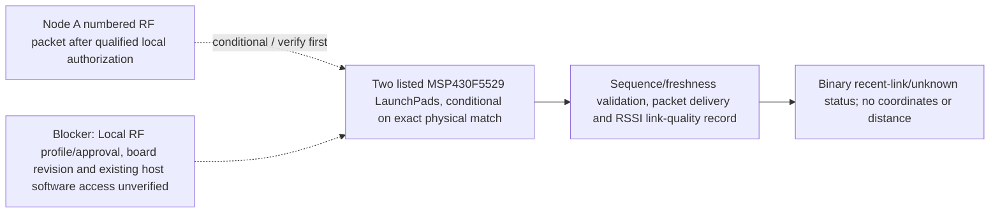

# Sub-GHz Industrial Asset Tracking and Telemetry — System Block Diagram

```mermaid
flowchart LR
    S["Node A numbered RF packet after qualified local authorization"] -. conditional / verify first .-> H["Two listed MSP430F5529 LaunchPads, conditional on exact physical match"]
    H --> Q["Sequence/freshness validation, packet delivery and RSSI link-quality record"]
    Q --> O["Binary recent-link/unknown status; no coordinates or distance"]
    B["Blocker: Local RF profile/approval, board revision and existing host software access unverified"] -.-> H
```

Research architecture only. No physical path has been tested.
