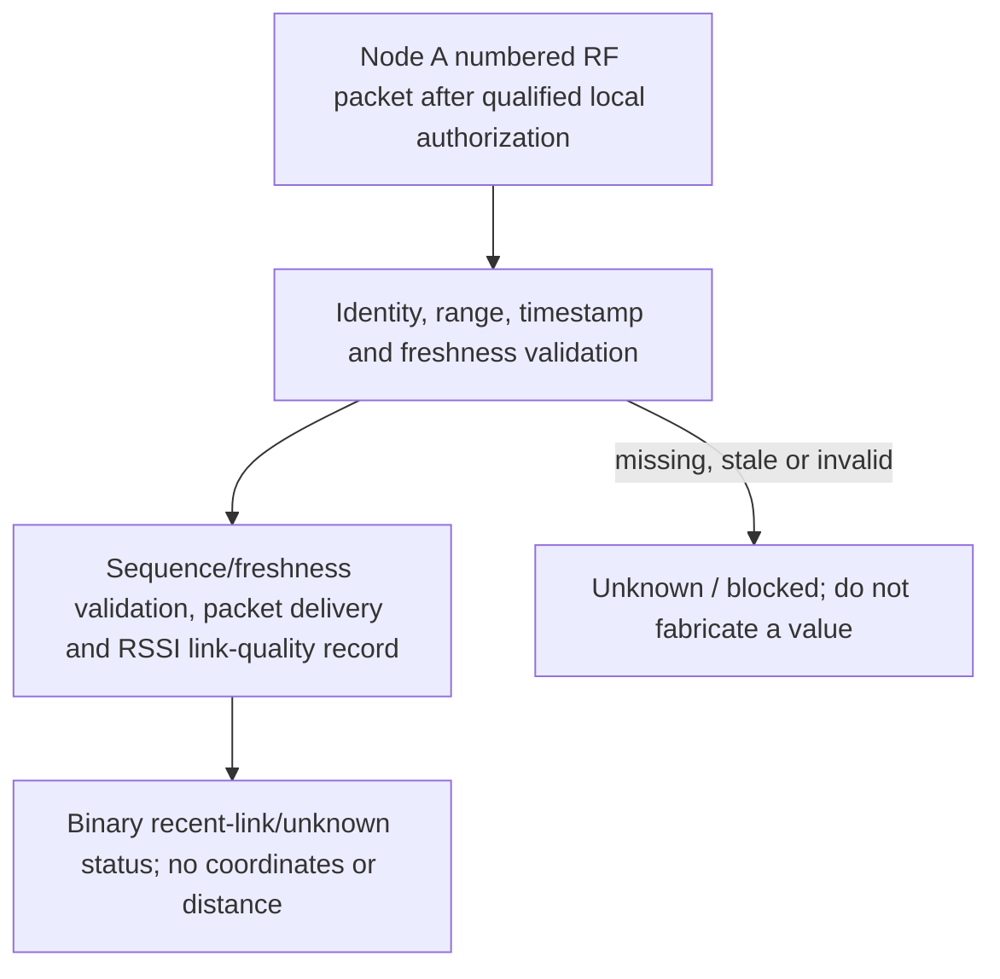

# Sub-GHz Industrial Asset Tracking and Telemetry — Data Flow

```mermaid
flowchart TD
    A["Node A numbered RF packet after qualified local authorization"] --> V["Identity, range, timestamp and freshness validation"]
    V --> P["Sequence/freshness validation, packet delivery and RSSI link-quality record"]
    P --> O["Binary recent-link/unknown status; no coordinates or distance"]
    V -->|missing, stale or invalid| U["Unknown / blocked; do not fabricate a value"]
```

No sample schema or measurements are available yet.
