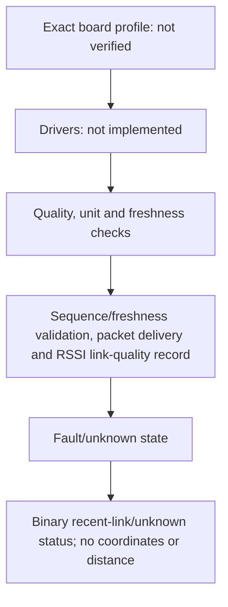

# Sub-GHz Industrial Asset Tracking and Telemetry — Software Architecture

```mermaid
flowchart TB
    C["Exact board profile: not verified"] --> D["Drivers: not implemented"]
    D --> Q["Quality, unit and freshness checks"]
    Q --> A["Sequence/freshness validation, packet delivery and RSSI link-quality record"]
    A --> F["Fault/unknown state"]
    F --> O["Binary recent-link/unknown status; no coordinates or distance"]
```

Software design only. Toolchain and code are not confirmed or implemented.
