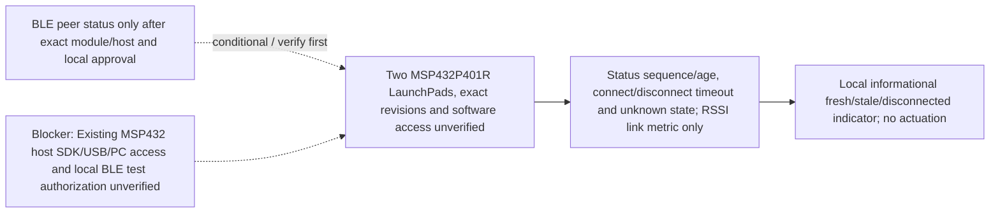

# BLE Industrial Proximity and Safety System — System Block Diagram

```mermaid
flowchart LR
    S["BLE peer status only after exact module/host and local approval"] -. conditional / verify first .-> H["Two MSP432P401R LaunchPads, exact revisions and software access unverified"]
    H --> Q["Status sequence/age, connect/disconnect timeout and unknown state; RSSI link metric only"]
    Q --> O["Local informational fresh/stale/disconnected indicator; no actuation"]
    B["Blocker: Existing MSP432 host SDK/USB/PC access and local BLE test authorization unverified"] -.-> H
```

Research architecture only. No physical path has been tested.
