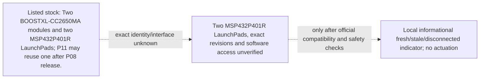

# BLE Industrial Proximity and Safety System — Hardware Connection Boundary

```mermaid
flowchart LR
    I["Listed stock: Two BOOSTXL-CC2650MA modules and two MSP432P401R LaunchPads; P11 may reuse one after P08 release."] -. exact identity/interface unknown .-> T["Two MSP432P401R LaunchPads, exact revisions and software access unverified"]
    T -. only after official compatibility and safety checks .-> E["Local informational fresh/stale/disconnected indicator; no actuation"]
```

No wiring, pin map, power setting, or RF emission is authorized by this diagram. See `hardware/VERIFICATION.md`.
