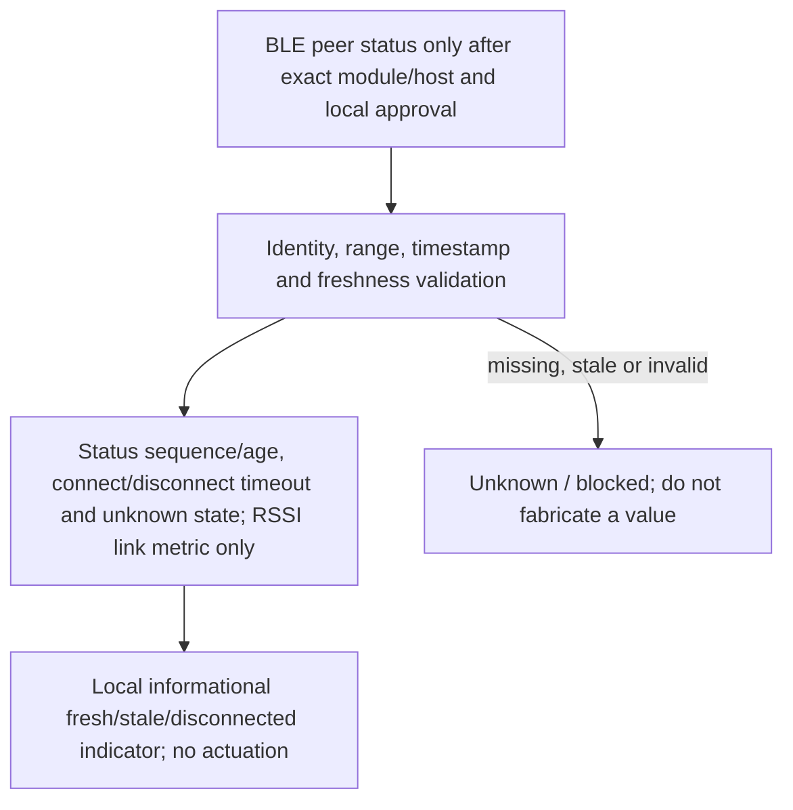

# BLE Industrial Proximity and Safety System — Data Flow

```mermaid
flowchart TD
    A["BLE peer status only after exact module/host and local approval"] --> V["Identity, range, timestamp and freshness validation"]
    V --> P["Status sequence/age, connect/disconnect timeout and unknown state; RSSI link metric only"]
    P --> O["Local informational fresh/stale/disconnected indicator; no actuation"]
    V -->|missing, stale or invalid| U["Unknown / blocked; do not fabricate a value"]
```

No sample schema or measurements are available yet.
