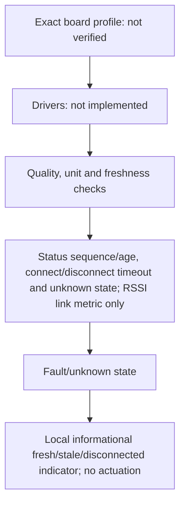

# BLE Industrial Proximity and Safety System — Software Architecture

```mermaid
flowchart TB
    C["Exact board profile: not verified"] --> D["Drivers: not implemented"]
    D --> Q["Quality, unit and freshness checks"]
    Q --> A["Status sequence/age, connect/disconnect timeout and unknown state; RSSI link metric only"]
    A --> F["Fault/unknown state"]
    F --> O["Local informational fresh/stale/disconnected indicator; no actuation"]
```

Software design only. Toolchain and code are not confirmed or implemented.
