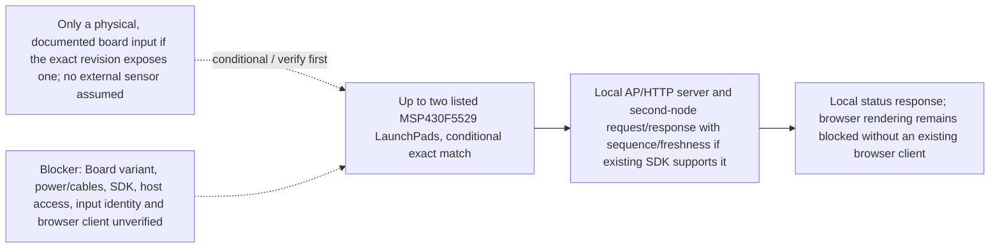

# CC3100 Embedded Industrial Web/Data Acquisition System — System Block Diagram

```mermaid
flowchart LR
    S["Only a physical, documented board input if the exact revision exposes one; no external sensor assumed"] -. conditional / verify first .-> H["Up to two listed MSP430F5529 LaunchPads, conditional exact match"]
    H --> Q["Local AP/HTTP server and second-node request/response with sequence/freshness if existing SDK supports it"]
    Q --> O["Local status response; browser rendering remains blocked without an existing browser client"]
    B["Blocker: Board variant, power/cables, SDK, host access, input identity and browser client unverified"] -.-> H
```

Research architecture only. No physical path has been tested.
