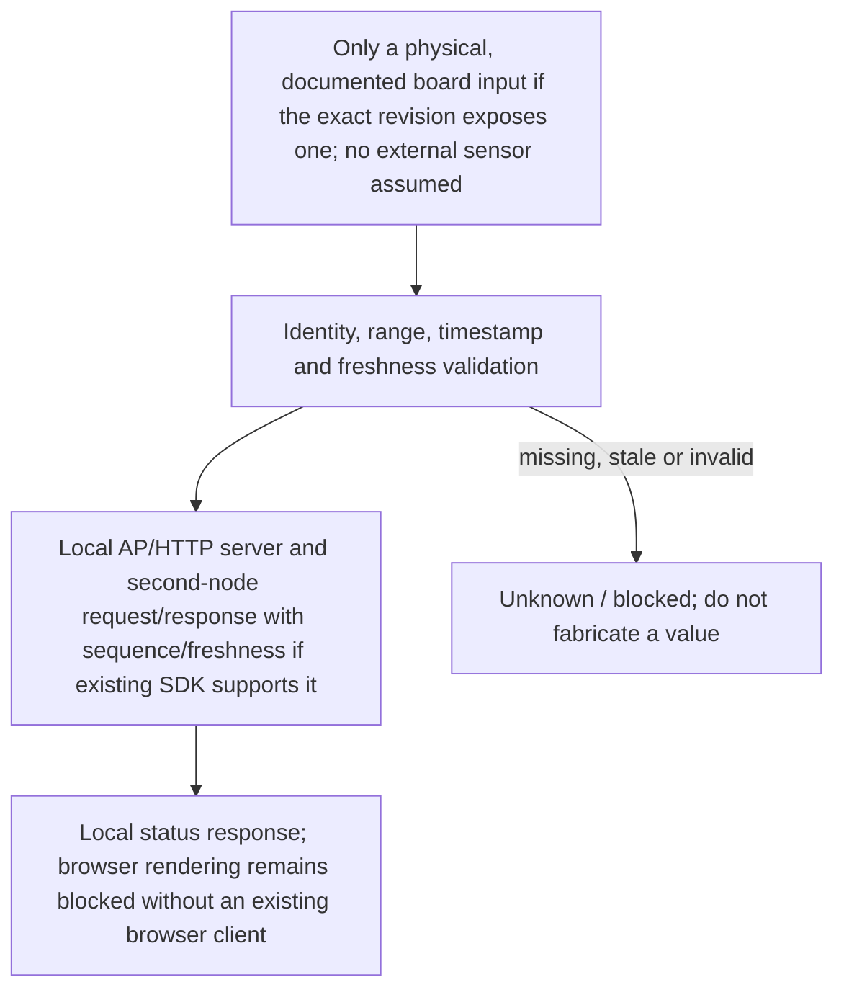

# CC3100 Embedded Industrial Web/Data Acquisition System — Data Flow

```mermaid
flowchart TD
    A["Only a physical, documented board input if the exact revision exposes one; no external sensor assumed"] --> V["Identity, range, timestamp and freshness validation"]
    V --> P["Local AP/HTTP server and second-node request/response with sequence/freshness if existing SDK supports it"]
    P --> O["Local status response; browser rendering remains blocked without an existing browser client"]
    V -->|missing, stale or invalid| U["Unknown / blocked; do not fabricate a value"]
```

No sample schema or measurements are available yet.
