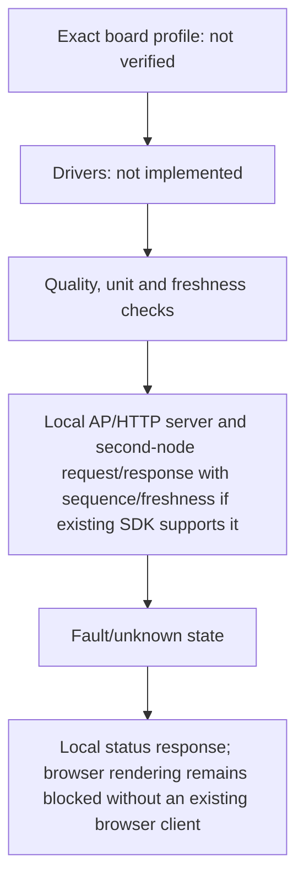

# CC3100 Embedded Industrial Web/Data Acquisition System — Software Architecture

```mermaid
flowchart TB
    C["Exact board profile: not verified"] --> D["Drivers: not implemented"]
    D --> Q["Quality, unit and freshness checks"]
    Q --> A["Local AP/HTTP server and second-node request/response with sequence/freshness if existing SDK supports it"]
    A --> F["Fault/unknown state"]
    F --> O["Local status response; browser rendering remains blocked without an existing browser client"]
```

Software design only. Toolchain and code are not confirmed or implemented.
