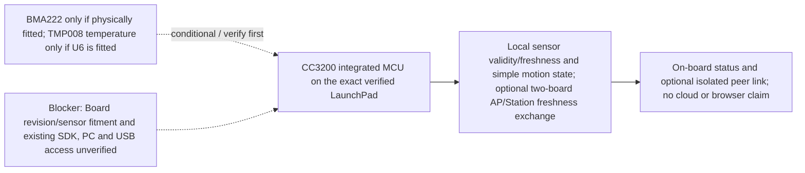

# CC3200 Autonomous Industrial IoT Edge Gateway — System Block Diagram

```mermaid
flowchart LR
    S["BMA222 only if physically fitted; TMP008 temperature only if U6 is fitted"] -. conditional / verify first .-> H["CC3200 integrated MCU on the exact verified LaunchPad"]
    H --> Q["Local sensor validity/freshness and simple motion state; optional two-board AP/Station freshness exchange"]
    Q --> O["On-board status and optional isolated peer link; no cloud or browser claim"]
    B["Blocker: Board revision/sensor fitment and existing SDK, PC and USB access unverified"] -.-> H
```

Research architecture only. No physical path has been tested.
