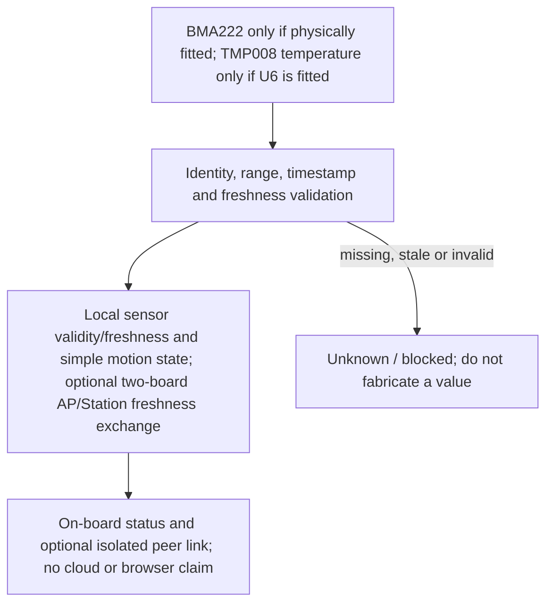

# CC3200 Autonomous Industrial IoT Edge Gateway — Data Flow

```mermaid
flowchart TD
    A["BMA222 only if physically fitted; TMP008 temperature only if U6 is fitted"] --> V["Identity, range, timestamp and freshness validation"]
    V --> P["Local sensor validity/freshness and simple motion state; optional two-board AP/Station freshness exchange"]
    P --> O["On-board status and optional isolated peer link; no cloud or browser claim"]
    V -->|missing, stale or invalid| U["Unknown / blocked; do not fabricate a value"]
```

No sample schema or measurements are available yet.
