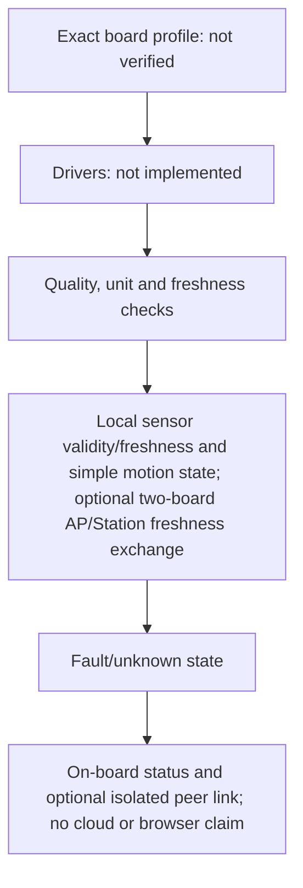

# CC3200 Autonomous Industrial IoT Edge Gateway — Software Architecture

```mermaid
flowchart TB
    C["Exact board profile: not verified"] --> D["Drivers: not implemented"]
    D --> Q["Quality, unit and freshness checks"]
    Q --> A["Local sensor validity/freshness and simple motion state; optional two-board AP/Station freshness exchange"]
    A --> F["Fault/unknown state"]
    F --> O["On-board status and optional isolated peer link; no cloud or browser claim"]
```

Software design only. Toolchain and code are not confirmed or implemented.
