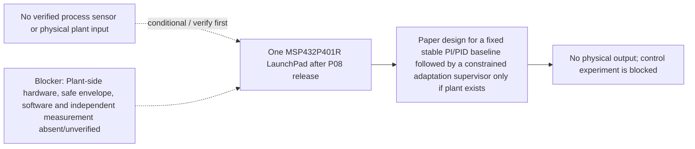

# MSP432 Real-Time Adaptive Industrial Control System — System Block Diagram

```mermaid
flowchart LR
    S["No verified process sensor or physical plant input"] -. conditional / verify first .-> H["One MSP432P401R LaunchPad after P08 release"]
    H --> Q["Paper design for a fixed stable PI/PID baseline followed by a constrained adaptation supervisor only if plant exists"]
    Q --> O["No physical output; control experiment is blocked"]
    B["Blocker: Plant-side hardware, safe envelope, software and independent measurement absent/unverified"] -.-> H
```

Research architecture only. No physical path has been tested.
