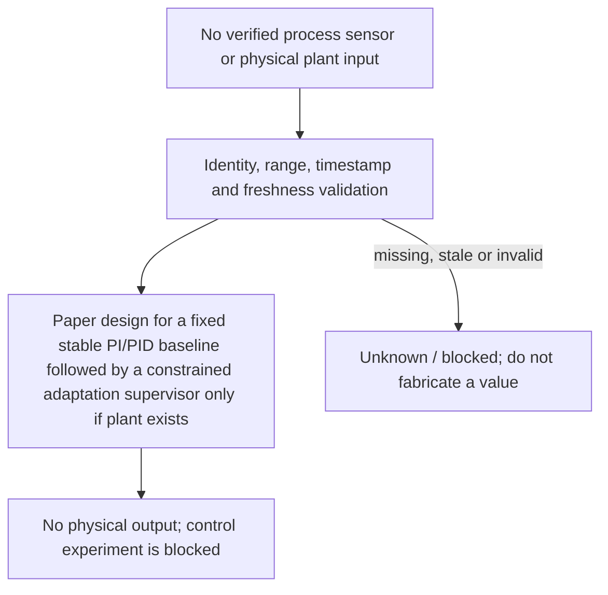

# MSP432 Real-Time Adaptive Industrial Control System — Data Flow

```mermaid
flowchart TD
    A["No verified process sensor or physical plant input"] --> V["Identity, range, timestamp and freshness validation"]
    V --> P["Paper design for a fixed stable PI/PID baseline followed by a constrained adaptation supervisor only if plant exists"]
    P --> O["No physical output; control experiment is blocked"]
    V -->|missing, stale or invalid| U["Unknown / blocked; do not fabricate a value"]
```

No sample schema or measurements are available yet.
