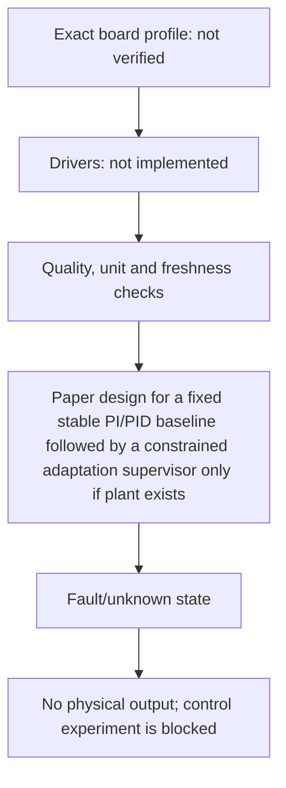

# MSP432 Real-Time Adaptive Industrial Control System — Software Architecture

```mermaid
flowchart TB
    C["Exact board profile: not verified"] --> D["Drivers: not implemented"]
    D --> Q["Quality, unit and freshness checks"]
    Q --> A["Paper design for a fixed stable PI/PID baseline followed by a constrained adaptation supervisor only if plant exists"]
    A --> F["Fault/unknown state"]
    F --> O["No physical output; control experiment is blocked"]
```

Software design only. Toolchain and code are not confirmed or implemented.
