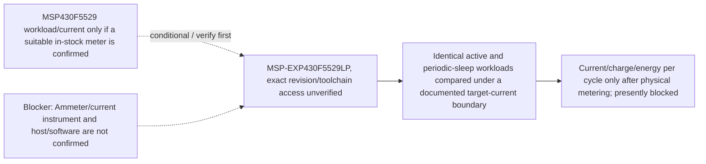

# MSP430 Ultra-Low-Power Industrial Sensor Node — System Block Diagram

```mermaid
flowchart LR
    S["MSP430F5529 workload/current only if a suitable in-stock meter is confirmed"] -. conditional / verify first .-> H["MSP-EXP430F5529LP, exact revision/toolchain access unverified"]
    H --> Q["Identical active and periodic-sleep workloads compared under a documented target-current boundary"]
    Q --> O["Current/charge/energy per cycle only after physical metering; presently blocked"]
    B["Blocker: Ammeter/current instrument and host/software are not confirmed"] -.-> H
```

Research architecture only. No physical path has been tested.
