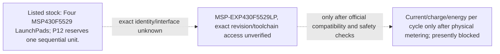

# MSP430 Ultra-Low-Power Industrial Sensor Node — Hardware Connection Boundary

```mermaid
flowchart LR
    I["Listed stock: Four MSP430F5529 LaunchPads; P12 reserves one sequential unit."] -. exact identity/interface unknown .-> T["MSP-EXP430F5529LP, exact revision/toolchain access unverified"]
    T -. only after official compatibility and safety checks .-> E["Current/charge/energy per cycle only after physical metering; presently blocked"]
```

No wiring, pin map, power setting, or RF emission is authorized by this diagram. See `hardware/VERIFICATION.md`.
