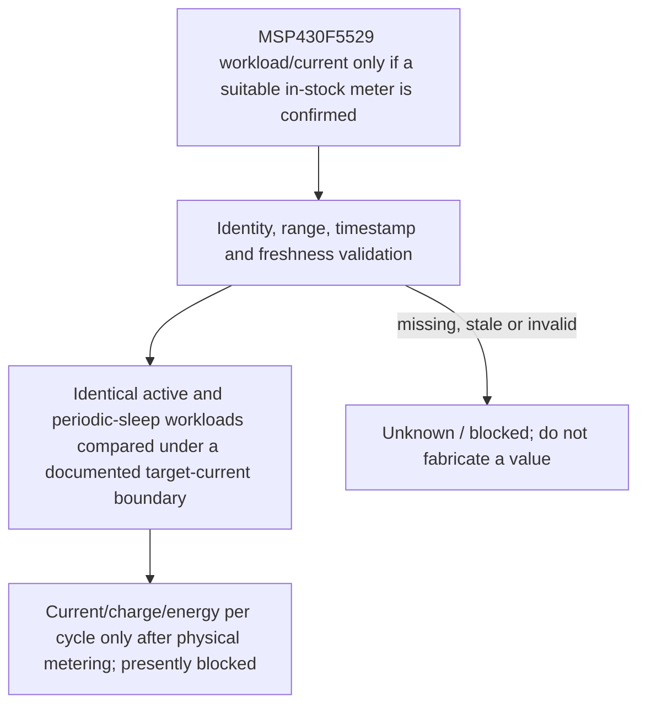

# MSP430 Ultra-Low-Power Industrial Sensor Node — Data Flow

```mermaid
flowchart TD
    A["MSP430F5529 workload/current only if a suitable in-stock meter is confirmed"] --> V["Identity, range, timestamp and freshness validation"]
    V --> P["Identical active and periodic-sleep workloads compared under a documented target-current boundary"]
    P --> O["Current/charge/energy per cycle only after physical metering; presently blocked"]
    V -->|missing, stale or invalid| U["Unknown / blocked; do not fabricate a value"]
```

No sample schema or measurements are available yet.
