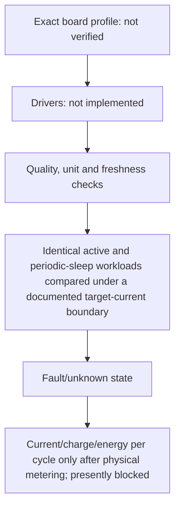

# MSP430 Ultra-Low-Power Industrial Sensor Node — Software Architecture

```mermaid
flowchart TB
    C["Exact board profile: not verified"] --> D["Drivers: not implemented"]
    D --> Q["Quality, unit and freshness checks"]
    Q --> A["Identical active and periodic-sleep workloads compared under a documented target-current boundary"]
    A --> F["Fault/unknown state"]
    F --> O["Current/charge/energy per cycle only after physical metering; presently blocked"]
```

Software design only. Toolchain and code are not confirmed or implemented.
