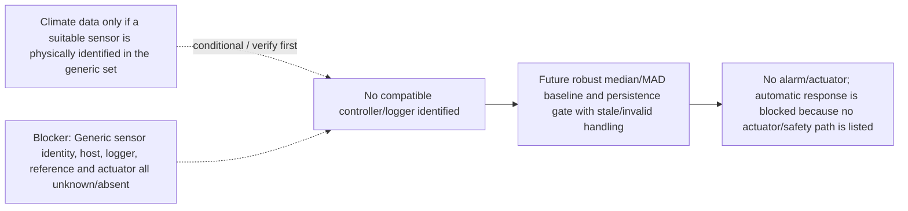

# Industrial Climate Anomaly Detection and Automatic Response — System Block Diagram

```mermaid
flowchart LR
    S["Climate data only if a suitable sensor is physically identified in the generic set"] -. conditional / verify first .-> H["No compatible controller/logger identified"]
    H --> Q["Future robust median/MAD baseline and persistence gate with stale/invalid handling"]
    Q --> O["No alarm/actuator; automatic response is blocked because no actuator/safety path is listed"]
    B["Blocker: Generic sensor identity, host, logger, reference and actuator all unknown/absent"] -.-> H
```

Research architecture only. No physical path has been tested.
