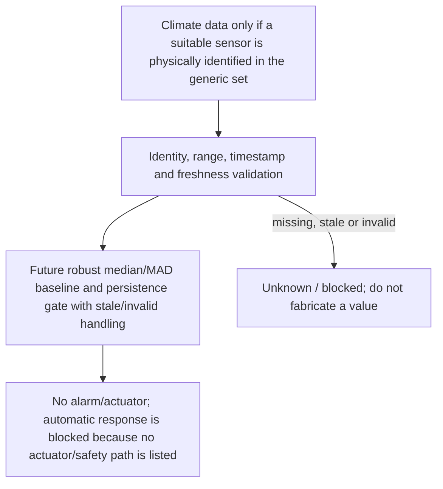

# Industrial Climate Anomaly Detection and Automatic Response — Data Flow

```mermaid
flowchart TD
    A["Climate data only if a suitable sensor is physically identified in the generic set"] --> V["Identity, range, timestamp and freshness validation"]
    V --> P["Future robust median/MAD baseline and persistence gate with stale/invalid handling"]
    P --> O["No alarm/actuator; automatic response is blocked because no actuator/safety path is listed"]
    V -->|missing, stale or invalid| U["Unknown / blocked; do not fabricate a value"]
```

No sample schema or measurements are available yet.
