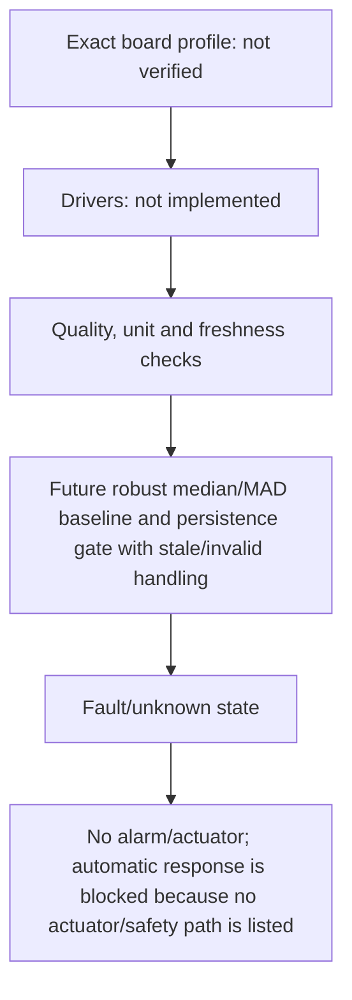

# Industrial Climate Anomaly Detection and Automatic Response — Software Architecture

```mermaid
flowchart TB
    C["Exact board profile: not verified"] --> D["Drivers: not implemented"]
    D --> Q["Quality, unit and freshness checks"]
    Q --> A["Future robust median/MAD baseline and persistence gate with stale/invalid handling"]
    A --> F["Fault/unknown state"]
    F --> O["No alarm/actuator; automatic response is blocked because no actuator/safety path is listed"]
```

Software design only. Toolchain and code are not confirmed or implemented.
