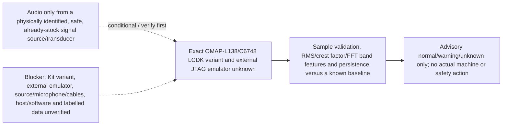

# OMAP-L138 Real-Time DSP Machine Fault Diagnosis — System Block Diagram

```mermaid
flowchart LR
    S["Audio only from a physically identified, safe, already-stock signal source/transducer"] -. conditional / verify first .-> H["Exact OMAP-L138/C6748 LCDK variant and external JTAG emulator unknown"]
    H --> Q["Sample validation, RMS/crest factor/FFT band features and persistence versus a known baseline"]
    Q --> O["Advisory normal/warning/unknown only; no actual machine or safety action"]
    B["Blocker: Kit variant, external emulator, source/microphone/cables, host/software and labelled data unverified"] -.-> H
```

Research architecture only. No physical path has been tested.
