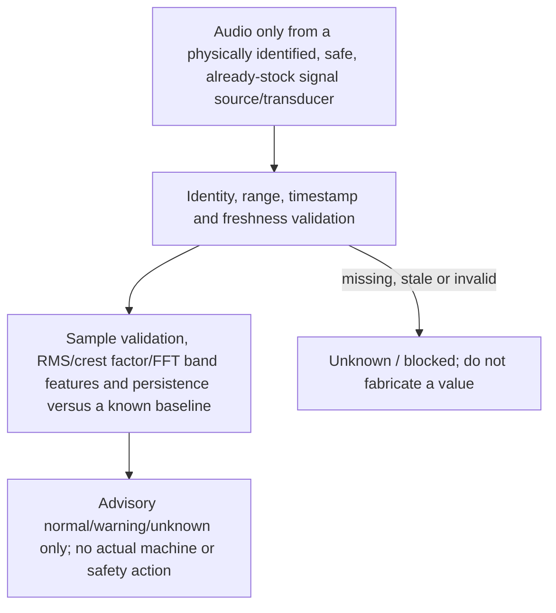

# OMAP-L138 Real-Time DSP Machine Fault Diagnosis — Data Flow

```mermaid
flowchart TD
    A["Audio only from a physically identified, safe, already-stock signal source/transducer"] --> V["Identity, range, timestamp and freshness validation"]
    V --> P["Sample validation, RMS/crest factor/FFT band features and persistence versus a known baseline"]
    P --> O["Advisory normal/warning/unknown only; no actual machine or safety action"]
    V -->|missing, stale or invalid| U["Unknown / blocked; do not fabricate a value"]
```

No sample schema or measurements are available yet.
