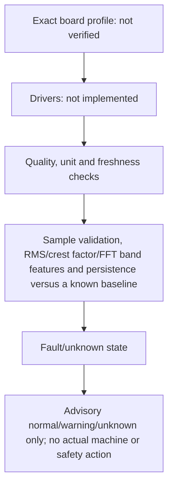

# OMAP-L138 Real-Time DSP Machine Fault Diagnosis — Software Architecture

```mermaid
flowchart TB
    C["Exact board profile: not verified"] --> D["Drivers: not implemented"]
    D --> Q["Quality, unit and freshness checks"]
    Q --> A["Sample validation, RMS/crest factor/FFT band features and persistence versus a known baseline"]
    A --> F["Fault/unknown state"]
    F --> O["Advisory normal/warning/unknown only; no actual machine or safety action"]
```

Software design only. Toolchain and code are not confirmed or implemented.
